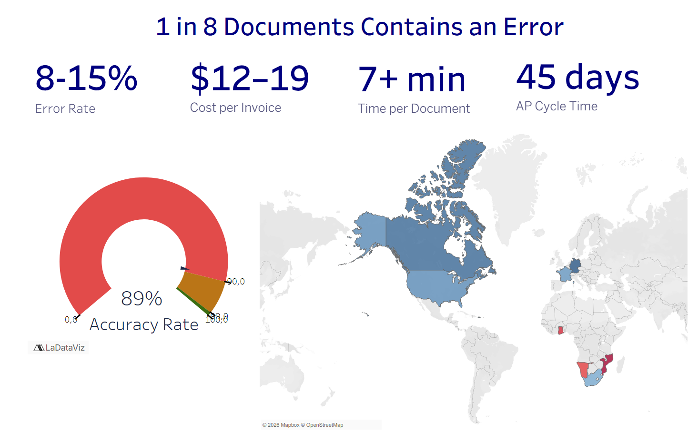
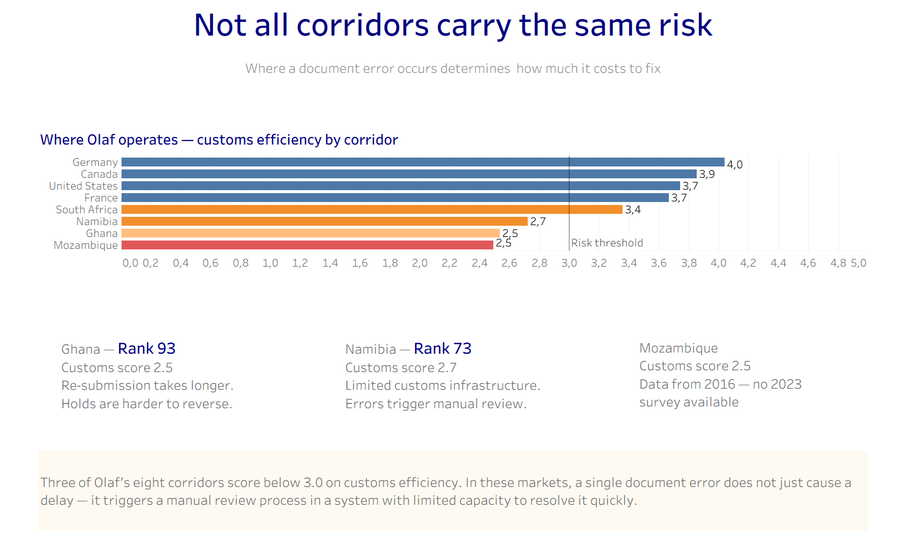
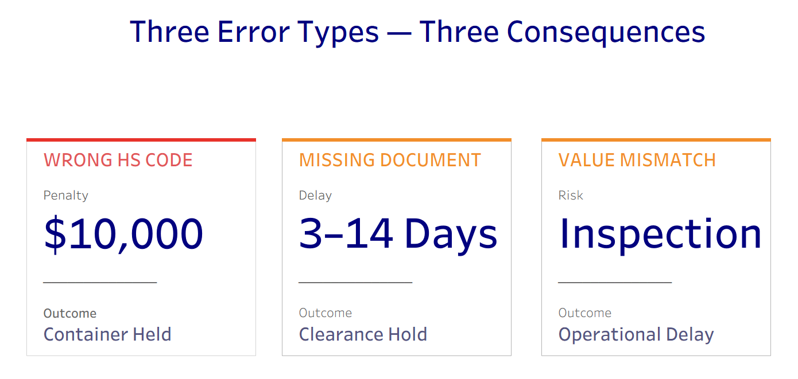
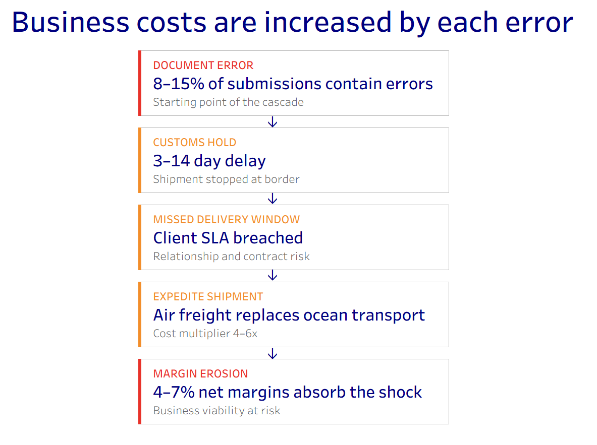
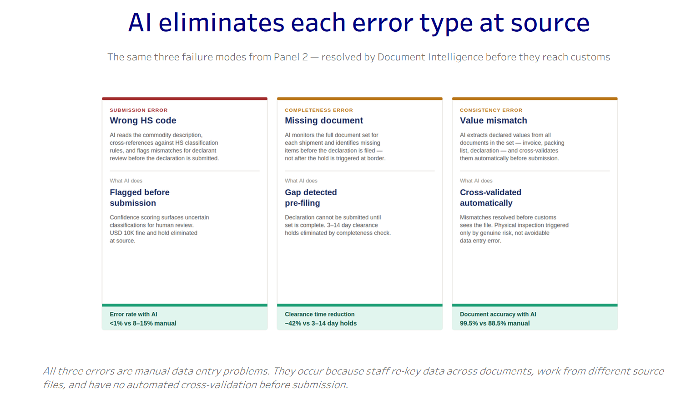
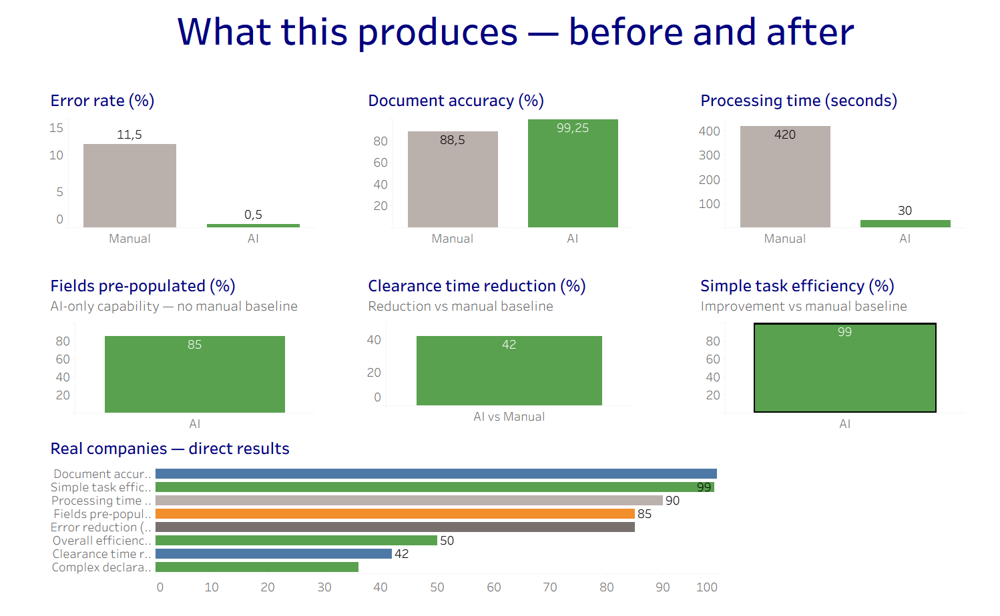
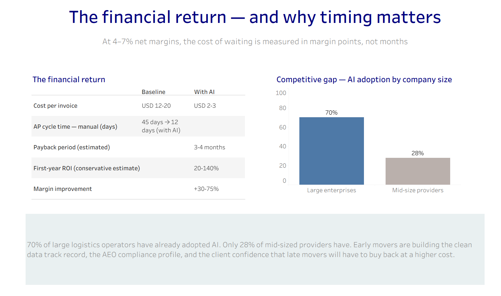

# Dashboard Documentation — AI Adoption Opportunity
**Project:** AI Adoption Opportunity — Document Intelligence
**Client:** CEO Olaf Müller, Hamburg-based logistics and transportation company (500 employees, 16 locations, 8 countries)
**Tool:** Tableau Desktop
**Workbook:** `Dashboard_ai_opportunity_v2.twb`
**Prepared:** June 2026

---

## 1. Use Case Description

This dashboard tells a single argument across two acts and nine panels. It is designed for a one-to-one executive presentation to CEO Olaf Müller and builds the case for investing in AI-powered Document Intelligence for customs and invoice processing.

**Act 1 — The Problem (Panels 1–3)**
No mention of AI. The viewer reads three panels that describe the current operational reality — error rates, error types and their consequences, and how each error compounds into a chain of business cost. By the end of Act 1, the problem is established and felt, not just stated.

**Act 2 — The Solution (Panels 4–5)**
AI is introduced as the answer to a problem already established. Panel 4 resolves each error type from Panel 2. Panel 5 presents the financial return and the competitive urgency.

**Supporting panels:**
- Panel 1.2 adds geographic context — not all corridors carry the same risk
- Panel 6 consolidates all sources

**Story flow:**

| Panel | Title | Act |
|---|---|---|
| 1.1 | 1 in 8 documents contains an error | Problem |
| 1.2 | Not all corridors carry the same risk | Problem |
| 2 | Three error types — three consequences | Problem |
| 3.1 | Each error compounds into a chain of business cost | Problem |
| 3.2 | Business impact when adopting AI | Transition to AI |
| 4.1 | AI eliminates each error type at source | Solution |
| 4.2 | What this produces — before and after | Solution |
| 5 | The financial return — and why timing matters | Solution |
| 6 | Sources | Reference |


**Honest approach followed:**
The original story flow was different. The planned graphs and initial dataset were mostly dropped. I thought this final story was the best and easiest. As for the graphs, I'm aware they can be improved, but considerable time was invested in creating simple ones. Nevertheless, I can confirm that the learning experience was highly satisfactory. 

---

## 2. Data Sources

### 2.1 Primary data sources

| File | Location | Used in panels | Description |
|---|---|---|---|
| `benchmarks.xlsx` | `data/processed/benchmarks.xlsx` | 1.1, 1.2, 2, 3, 4, 5 | Pre-curated AI vs manual performance benchmarks. One row per metric per scenario. Key columns: `metric`, `scenario`, `kpi_value`, `unit`, `category`, `source` |
| `company_cases.xlsx` | `data/processed/company_cases.xlsx` | 4.2 | Operator case study results. Filtered on `relevance_to_muller = 'Direct'` and `result_type = 'Quantitative'` for the "Real companies — direct results" chart |
| `LPI_data.xlsx` | `data/processed/LPI_data.xlsx` | 1.2 | World Bank Logistics Performance Index 2023. One row per country × indicator × year. Key columns: `country_name`, `indicator_label`, `value`, `year` |
| `LPI_countries.xlsx` | `data/processed/LPI_countries.xlsx` | 1.2 | Country metadata joined to LPI_data. Key columns: `country_code`, `country_short_name`, `region`, `income_group` |

### 2.2 Data source joins

**LPI join (Panel 1.2):**
`LPI_data.xlsx` is the primary table. `LPI_countries.xlsx` is joined on `country_code = country_code` via a Tableau relationship. This adds `region` and `income_group` to the LPI data for color-coding by income group on the corridor chart.

### 2.3 Key filters applied across sheets

| Filter | Value | Applied in |
|---|---|---|
| `scenario` | `Manual` | Panels 1, 2, 3 |
| `scenario` | `AI` or `AI adoption` | Panel 4 |
| `scenario` | `Manual` + `AI` | Panel 4.2 small multiples |
| `category` | `Document Processing` | KPI sheets, Panel 1.1 |
| `category` | `ROI & Financial` | Panel 5 ROI table |
| `category` | `Market & Adoption` | Panel 5 competitive gap chart |
| `category` | `Supply Chain Impact` | Panel 3.2 |
| `indicator_label` | `customs_score` | Panel 1.2 corridor chart |
| `country_code` | DEU, FRA, GHA, MOZ, NAM, ZAF, CAN, USA | Panel 1.2 |

### 2.4 Calculated fields

| Field name | Formula | Purpose |
|---|---|---|
| `Scenario Grouped` | `IF [scenario] = "AI adoption" THEN "AI" ELSE [scenario] END` | Merges "AI" and "AI adoption" into one column for Panel 5 ROI table |
| `ROI Display` | `IF [metric] = "First-year ROI" THEN "20-140%" ELSEIF [metric] = "Payback period" THEN "3-4 months" ELSEIF [metric] = "Cost per invoice" AND [scenario] = "Manual" THEN "EUR 12-20" ELSEIF [metric] = "Cost per invoice" AND [scenario] = "AI" THEN "EUR 2-3" ELSEIF [metric] = "Accounts payable cycle time - manual" THEN "45 days → 12 days (with AI)" ELSEIF [metric] = "Margin improvement for 3PL" THEN "+30-75%" ELSE STR([kpi_value]) END` | Formats Panel 5 ROI table values as readable ranges |
| `Customs Score (FIXED)` | `{ FIXED [country_name] : MAX(IF [indicator_label] = "customs_score" THEN [value] END) }` | Extracts customs score per country for Panel 1.2 |
| `Customs Rank (FIXED)` | `{ FIXED [country_name] : MAX(IF [indicator_label] = "customs_rank" THEN [value] END) }` | Extracts customs rank per country for Panel 1.2 stat boxes |
| `Error Rate Display` | `STR(INT([kpi_value])) + "+"` | Formats error rate for KPI card on Panel 1.1 |
| `Cost Per Invoice Display` | `"$" + STR(INT(MIN([kpi_value]))) + "–" + STR(INT(MAX([kpi_value])))` | Formats cost range for KPI card |
| `Time Per Doc Display` | `STR(INT([kpi_value] / 60)) + "+ min"` | Converts seconds to minutes for KPI card |
| `AP Cycle Time Display` | `STR(INT([kpi_value])) + " days"` | Formats AP cycle time for KPI card |
| `Gauge Error Rate` | `SUM(IF [metric] = "Error rate" AND [scenario] = "Manual" THEN [kpi_value] END)` | Drives accuracy gauge chart on Panel 1.1 |

---

## 3. Sheet Inventory and Metric Explanations

### Panel 1 sheets

**`KPI_ErrorRate`**
Shows the manual document error rate: 8–15%.
- *What it means:* Between 8 and 15 out of every 100 submitted logistics documents contain at least one error — wrong field, missing field, or value mismatch.
- *Why it matters:* Each error triggers a downstream cascade. At 11.5% (midpoint), Müller submits approximately 1 in 9 documents with an error.
- *Source:* Fluxity.ai 2025

**`KPI_CostPerInvoice`**
Shows manual cost per invoice: EUR 12–20.
- *What it means:* The fully loaded cost of processing one invoice manually — staff time, rework, error correction, and overhead.
- *Why it matters:* At EUR 12–20 per invoice, document processing is a significant operational cost line. AI reduces this to EUR 2–3.
- *Source:* Parseur / APQC 2025

**`KPI_TimePerDoc`**
Shows manual processing time: 7+ minutes per document.
- *What it means:* Average time a staff member spends handling one document end-to-end — reading, re-keying, cross-checking, filing.
- *Why it matters:* At 5 documents per hour, a team of 10 processes 400 documents per day maximum. Volume growth requires proportional headcount.
- *Source:* Docsumo IDP 2025

**`KPI_APCycleTime`**
Shows AP cycle time: 45 days.
- *What it means:* The number of days from receiving an invoice to completing processing, validation, and approval for payment.
- *Why it matters:* 45 days is the industry manual average. Errors extend this further. AI reduces it to 12 days — releasing working capital and improving supplier relationships.
- *Source:* DocStreams.ai 2025

**`Gauge_ErrorRate_v2`**
Gauge chart showing 89% accuracy rate (inverse of 11% error rate).
- *What it means:* Visual representation of document accuracy — the red arc shows the error proportion.
- *Why it matters:* The gauge format makes the 11% error rate visceral rather than abstract.

**`Gauge_Accuracy`**
Supporting gauge for document accuracy rate.

---

### Panel 1.2 sheets

**`RiskMap_Corridor`**
Horizontal bar chart — customs efficiency score (1–5) for Müller's 8 operating corridors, colored by income group, with a reference line at 3.0.
- *What it means:* World Bank LPI customs score measures the efficiency of the clearance process in each country — speed, simplicity, and predictability of customs formalities.
- *Why it matters:* A document error on a Germany corridor (score 3.9) is resolved quickly. The same error on a Mozambique corridor (score 2.5) enters a slower, less predictable resolution process. The cost of an error is not constant — it scales with corridor risk.
- *Reference line at 3.0:* Indicates the informal threshold below which customs resolution time and unpredictability increase significantly.
- *Source:* World Bank LPI 2023 (CC BY 4.0). Mozambique: 2016 data (no 2023 survey available).

**`customs efficiency`**
Supporting sheet for the LPI corridor chart.

---

### Panel 3.2 sheets

**`AP cycle time (days)`**
Bar chart — Manual (45 days, grey) vs AI (12 days, green).
- *What it means:* Side-by-side comparison of AP cycle time before and after AI adoption.
- *Why it matters:* A 33-day reduction in AP cycle time directly impacts working capital, supplier payment terms, and finance team capacity.

**Note:** AP cycle time refers to accounts payable cycle time, meaning the number of days from receiving an invoice to completing its processing and approval for payment.

**`Business Impact`**
Bar chart — three green bars showing potential impact of AI adoption: logistics cost reduction (15%), margin improvement (52.5%), service level improvement (65%).
- *What it means:* Aggregate impact metrics from early AI adopters in logistics, sourced from McKinsey, StartUs Insights, and the European Logistics Association.
- *Why it matters:* These are the consequence metrics — what happens to the business when the error cascade is stopped. They frame the financial stakes before the ROI panel.
- *Source:* McKinsey / StartUs Insights / European Logistics Association 2025

---

### Panel 4.2 sheets

**`metric_error_rate`**
Two-bar chart — Manual (11.5%) vs AI (0.5%).
- *What it means:* Error rate drops from 11.5% to under 1% with AI document processing.
- *Why it matters:* A 95%+ reduction in error rate eliminates the trigger for the entire cost cascade shown in Panel 3.

**`metric_accuracy`**
Two-bar chart — Manual (88.5%) vs AI (99.25%).
- *What it means:* Document accuracy rate improves from 88.5% to 99.25%.
- *Why it matters:* 99.25% accuracy means fewer than 1 in 100 fields contains an error — compared to roughly 1 in 9 documents manually.

**`metric_processing_time`**
Two-bar chart — Manual (420 seconds) vs AI (30 seconds).
- *What it means:* Processing time per document drops from 7 minutes to 30 seconds.
- *Why it matters:* A 14x speed improvement means the same team can handle significantly higher document volume without additional headcount.

**`metric_fields_prepopulated`**
Single bar — AI: 85% fields pre-populated.
- *What it means:* AI automatically fills 85% of declaration fields from incoming documents. Staff only touch the remaining 15%.
- *Why it matters:* Eliminates the majority of manual re-keying — the root cause of most errors.
- *Source:* FreightMynd 2026

**`metric_clearance`**
Single bar — AI vs Manual: 42% clearance time reduction.
- *What it means:* Customs clearance time is reduced by 42% on corridors using AI document processing.
- *Why it matters:* Faster clearance directly reduces the risk of missed delivery windows and air freight escalation.
- *Source:* CR Express CFS operations, Dec 2025

**`metric_simple`**
Single bar — AI: 99% efficiency improvement on simple tasks.
- *What it means:* Simple, repetitive customs declaration tasks (high-volume, standard goods) are processed 99% more efficiently with AI.
- *Why it matters:* CSG's real-world result — the closest structural benchmark to Müller — demonstrates this is achievable at comparable scale.
- *Source:* Customs Support Group 2025

**`Real companies`**
Horizontal bar chart — quantitative results from Direct-relevance operator case studies: CSG, CR Express, FreightMynd, KlearNow.AI, unnamed mid-size logistics operator.
- *What it means:* Named companies with structurally similar operations to Müller have achieved these results in production deployments — not benchmarks or projections.
- *Why it matters:* Addresses Olaf's likely concern: "Is this proven at a company our size?" CSG (14 European markets, same customs workflows) is the most direct answer.

**Short descriptions of the referred companies:**

* **CSG — Customs Support Group**: A European customs and trade solutions provider operating across 14 European markets. Deployed AI-powered document processing in 2025. The closest structural benchmark to Müller — same scale, same customs workflows, same document types.
* **CR Express**: A Chinese cross-border e-commerce logistics operator running Container Freight Station (CFS) operations. Achieved 42% clearance time reduction and 99.5% document accuracy with AI document processing.
* **FreightMynd**: A logistics AI platform specialising in customs declaration automation. Their benchmark of 85% fields pre-populated from commercial invoices and packing lists is the source for the fields pre-populated metric.
* **KlearNow.AI**: A US-based customs intelligence platform. Reported 85% reduction in manual entry errors across their customs document processing deployments.
* **Processing time reduction (unnamed)**: This one is the exception — it's a mid-size logistics company that reported 90% processing time reduction. The company name was not disclosed in the source (DocShipper 2025 trade publication). The result is real but the operator is anonymous.


---

### Panel 5 sheets

**`KPI_panel5`** / **`ROI_panel5`**
Text table — financial return comparison across five metrics: Cost per invoice, AP cycle time, Payback period, First-year ROI, Margin improvement.
- *What it means:* Side-by-side view of the financial position without AI (Baseline) vs with AI.
- *Why it matters:* Translates all previous operational metrics into financial language for the CEO.

**`Real companies`** (also used in Panel 4.2)
See Panel 4.2 description above.

**Competitive gap chart** (built from `benchmarks.xlsx`, `Market & Adoption` category)
Two-bar chart — Large enterprises: 70% AI adoption vs Mid-size providers: 28%.
- *What it means:* The adoption gap between large and mid-size logistics operators.
- *Why it matters:* 70% of large operators have already adopted AI. At 28%, mid-size providers like Müller are building a structural disadvantage in cost, speed, and compliance profile. The window to act without being a late mover is narrowing.
- *Source:* Penske Transportation Leaders Survey 2025 / DocShipper 2025

---

## 4. Design Rationale

### 4.1 Two-act narrative structure
The dashboard deliberately withholds AI until Panel 4. Panels 1–3 establish the problem using only operational data — error rates, consequences, cost chains — so that when AI appears in Panel 4, it is the answer to a problem already felt, not a product pitch. This mirrors the structure of effective executive presentations: problem first, solution second.

### 4.2 Panel 2 ↔ Panel 4 mirror
The three error type cards in Panel 2 (Wrong HS code, Missing document, Value mismatch) use the same layout as Panel 4.1. Red and amber borders in Panel 2 become green borders in Panel 4. The visual continuity is intentional — Olaf reads Panel 4 as "these same problems, resolved."

### 4.3 Color system
The dashboard uses a consistent four-color system throughout:

| Color | Hex | Meaning |
|---|---|---|
| Dark navy | `#1a2a5e` | Primary text, titles, high-income corridor bars |
| Amber / orange | `#BA7517` / `#E8A020` | Warning, manual process, consequence |
| Red | `#A32D2D` | Highest-risk errors and corridors |
| Green | `#1D9E75` | AI, improvement, solution |
| Grey | `#BDBDBD` | Manual baseline bars, neutral |

### 4.4 Static images for narrative cards
Three panels use PNG images rather than live Tableau objects:
- **Panel 1.2 stat boxes** (Ghana, Namibia, Mozambique rank callouts)
- **Panel 3.1 cost chain** (cascade of five steps: Document Error → Customs Hold → Missed Window → Expedite Shipment → Margin Erosion)
- **Panel 4.1 three error cards** (Wrong HS code, Missing document, Value mismatch)

These are static because their content is hardcoded narrative text with no data behind it. Using images gives full typographic control (colored left borders, font weights, card layout) that Tableau text objects cannot replicate precisely.

### 4.5 Small multiples for before/after metrics (Panel 4.2)
Six separate charts rather than one combined chart. When Manual and AI metrics share an axis, the story is compressed — the reader has to work to see the contrast. Six individual charts, each scaled to its own metric, make every improvement immediately visible.

### 4.6 Reference line at 3.0 on corridor chart
The World Bank LPI scale runs 1–5. A reference line at 3.0 on the Panel 1.2 corridor chart creates a visual threshold — corridors above 3.0 (Europe, North America) vs corridors below (Africa). This is not an official World Bank threshold but a presentational device to make the geographic risk argument immediately readable.

### 4.7 Text table for Panel 5 ROI
The financial return is presented as a text table rather than bar charts. Financial metrics at CEO level are most credible as numbers, not visualised proportions. The ROI Display calculated field formats ranges (20–140%, 3–4 months) as text rather than averaged numeric values, which would misrepresent the data.

---

## 5. How to Use the Dashboard

### 5.1 Presenting to Olaf Müller
The dashboard is designed for linear, panel-by-panel presentation. Navigate using the Tableau story navigator or present each dashboard tab sequentially. The recommended presentation order follows the panel numbering: 1.1 → 1.2 → 2 → 3.1 → 3.2 → 4.1 → 4.2 → 5 → 6.

Do not skip from Panel 1 to Panel 4. The emotional logic of the presentation depends on the problem being fully established before the solution appears.

### 5.2 Navigation
Each panel is a separate Tableau dashboard tab at the bottom of the workbook. Tab names correspond to panel titles. No interactive filters are exposed to the viewer — the dashboard is read-only presentation mode.

### 5.3 Updating data
All panels except the static image panels update automatically when the source Excel files are refreshed:

1. Update the relevant source file (`benchmarks.xlsx`, `company_cases.xlsx`, `LPI_data.xlsx`, or `LPI_countries.xlsx`) at the path:
   `data/processed/`
2. In Tableau: **Data** menu → **Refresh Data Sources** (or press F5)
3. All live charts update immediately

**Static image panels** (Panel 1.2 stat boxes, Panel 3.1 cost chain, Panel 4.1 cards) must be regenerated manually as PNG files if their content changes. Source SVG files are available for re-export.

### 5.4 Workbook locale
The workbook locale is set to **English (United States)** to ensure decimal separators display as periods (3.9) rather than commas (3,9) throughout. Do not change the workbook locale without reviewing all formatted calculated fields.

### 5.5 Adding a new corridor to Panel 1.2
1. Add the country to `LPI_data.xlsx` with `indicator_label = 'customs_score'`
2. Add the country metadata to `LPI_countries.xlsx`
3. Update the `country_code` filter on the `customs efficiency` sheet to include the new country code
4. Refresh the data source

### 5.6 Known limitations
- **Mozambique data is from 2016.** No 2023 World Bank LPI survey data is available for Mozambique. The 2016 score (2.5) is used as the most recent available. A footnote is included on Panel 1.2.
- **First-year ROI is displayed as a range (20–140%), not a single value.** This is intentional — the ROI Display calculated field hardcodes the range as text. The underlying data rows (20 and 140) are averaged by Tableau if the raw `kpi_value` field is used instead.
- **Cost per invoice values are in EUR in documentation but display as USD in some KPI cards.** This reflects the original benchmark sources (Parseur/APQC, denominated in USD). For a EUR-denominated presentation, update the `Cost Per Invoice Display` calculated field to replace `"$"` with `"€"`.

---

## 6. Screenshots of Key Views

*Note: Screenshots should be captured from Tableau Desktop in Presentation Mode (View → Presentation Mode) at the dashboard's fixed dimensions for consistent output. The following views are recommended for documentation.*

---

### Screenshot 1 — Panel 1.1: 1 in 8 documents contains an error
**What to capture:** Full panel showing the four KPI cards (error rate, cost per invoice, time per document, AP cycle time) and the accuracy gauge.
**Key visual:** The 8–15% error rate headline and the 89% accuracy gauge.
**Screenshot:**  

---

### Screenshot 2 — Panel 1.2: Not all corridors carry the same risk
**What to capture:** Full panel showing the horizontal bar chart with the 3.0 reference line, the three country stat boxes (Ghana, Namibia, Mozambique), and the callout text.
**Key visual:** The clear gap between the four navy bars (Europe/North America, 3.7–4.0) and the four amber/red bars (Africa, 2.5–3.4).
**Screenshot:** 

---

### Screenshot 3 — Panel 2: Three error types — three consequences
**What to capture:** Full panel showing the three cards side by side (Wrong HS code / Missing document / Value mismatch) with red and amber top borders.
**Key visual:** The three-card layout that mirrors Panel 4.1 — the before state.
**Screenshot:** 

---

### Screenshot 4 — Panel 3.1: Cost chain cascade
**What to capture:** Full panel showing the five-step cascade (Document Error → Customs Hold → Missed Delivery Window → Expedite Shipment → Margin Erosion).
**Key visual:** The downward arrows connecting each step; the red borders on steps 1 and 5.
**Screenshot 3.1:** 
**Screenshot 3.2:** 

---

### Screenshot 5 — Panel 4.1: AI eliminates each error type at source
**What to capture:** Full panel showing the three cards with green bottom bands, the AI outcome text for each error type, and the callout text.
**Key visual:** The green bottom bands replacing the red/amber of Panel 2 — the mirror resolution.
**Screenshot:** 

---

### Screenshot 6 — Panel 4.2: What this produces — before and after
**What to capture:** Full panel showing the six small multiples (error rate, accuracy, processing time, fields pre-populated, clearance time, simple task efficiency) and the real companies bar chart.
**Key visual:** The error rate chart (11.5% grey vs 0.5% green) and the real companies chart with CSG at 99%.
**Screenshot:** 

---

### Screenshot 7 — Panel 5: The financial return
**What to capture:** Full panel showing the ROI text table (left) and the competitive gap bar chart (right, 70% vs 28%) with the callout text below.
**Key visual:** The competitive gap chart — the visual argument for acting now rather than waiting.
**Screenshot:** 

---

## 7. File and Folder Structure

```
ai-adoption-opportunity-project/
│
├── cost_estimation/
│   └── cost_analysis.md                  ← Cost scenarios and ROI model
│
├── dashboard/
│   ├── screenshots/                      ← Panel screenshots (see Section 6)
│   └── dashboard_documentation.md        ← This file
│
├── data/
│   ├── processed/                        ← Clean files connected to Tableau
│   │   ├── benchmarks.xlsx               ← Primary benchmark data (all panels)
│   │   ├── company_cases.xlsx            ← Operator case studies (Panel 4.2)
│   │   ├── dataset_sources_and_mapping.md← Data lineage and panel mapping
│   │   ├── LPI_countries.xlsx            ← Country metadata (Panel 1.2)
│   │   ├── LPI_data.xlsx                 ← World Bank LPI scores (Panel 1.2)
│   │   ├── LPI_indicators.xlsx           ← LPI indicator definitions
│   │   └── process_datasets.py           ← Script to regenerate processed files
│   │
│   └── raw/                              ← Original source files
│       ├── benchmarks.csv
│       ├── company_cases.csv
│       ├── LPICountry.csv
│       ├── LPICSV.csv
│       └── LPISeries.csv
│
├── implementation/
│   ├── implementation_plan.md            ← Phase-by-phase implementation steps
│   ├── solution_proposal.md              ← Investment recommendation and solution design
│   ├── technical_solution_draft.md       ← Technical architecture and AI specification
│   └── timeline_estimate.md             ← Timeline with 40% conservative adjustment
│
├── presentation/                         ← Tableau workbook and static panel assets
│   └── Dashboard_ai_opportunity_v2.twb  ← Tableau workbook
│
├── research/
│   ├── market_research.md               ← Industry overview and adoption signals
│   ├── opportunities_risks.md           ← Opportunity comparison and risk register
│   ├── sources.md                       ← Consolidated source list
│   └── use_case_discovery.md            ← Full use case justification
│
├── README.md                             ← Project overview and documentation index
├── requirements.txt                      ← Python dependencies
└── .gitignore
```

---

## 8. Sources Reference

| Panel | Sources |
|---|---|
| 1 | Fluxity.ai 2025 · Parseur / APQC 2025 · Docsumo IDP 2025 · DocStreams.ai 2025 |
| 1.2 | World Bank Logistics Performance Index 2023 (CC BY 4.0) · lpi.worldbank.org |
| 2–3 | Fluxity.ai 2025 · Parseur 2025 · Docsumo 2025 · StartUs Insights / McKinsey 2025 · European Logistics Association 2025 |
| 4 | CSG press release May 2025 · Intelligent CIO Europe April 2025 · CR Express Dec 2025 · FreightMynd Jan 2026 · KlearNow.AI 2025 |
| 5 | Docsumo / IDC 2025 · European Logistics Association 2025 · Penske Transportation Leaders Survey 2025 · DocShipper 2025 · Parseur / Vroozi 2025 |
